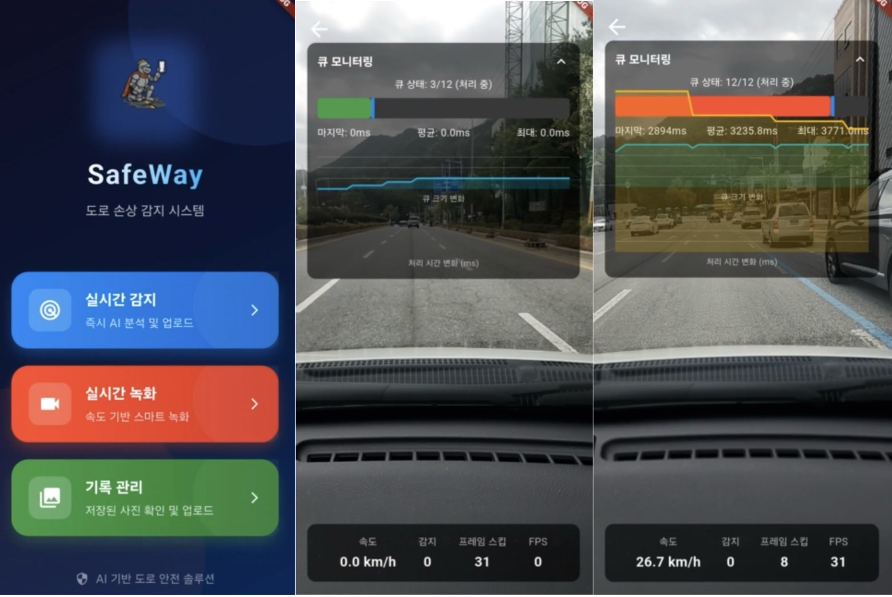
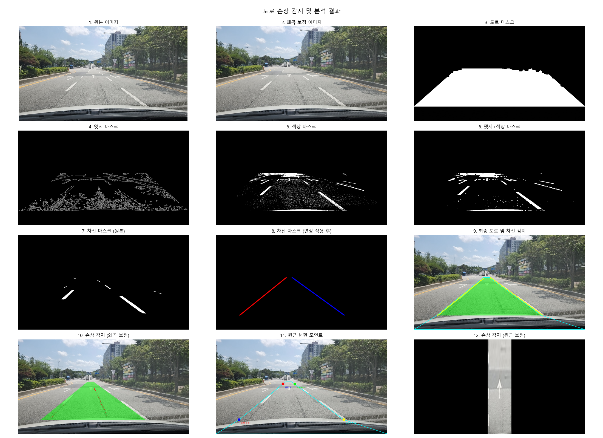
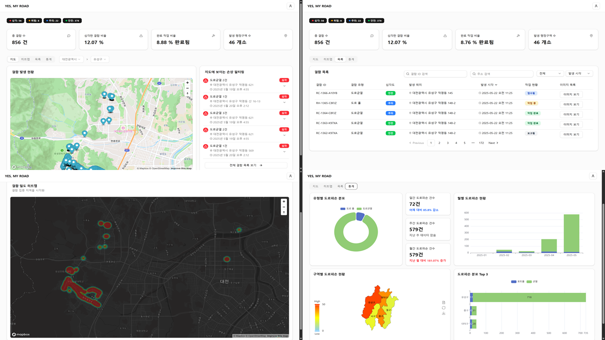
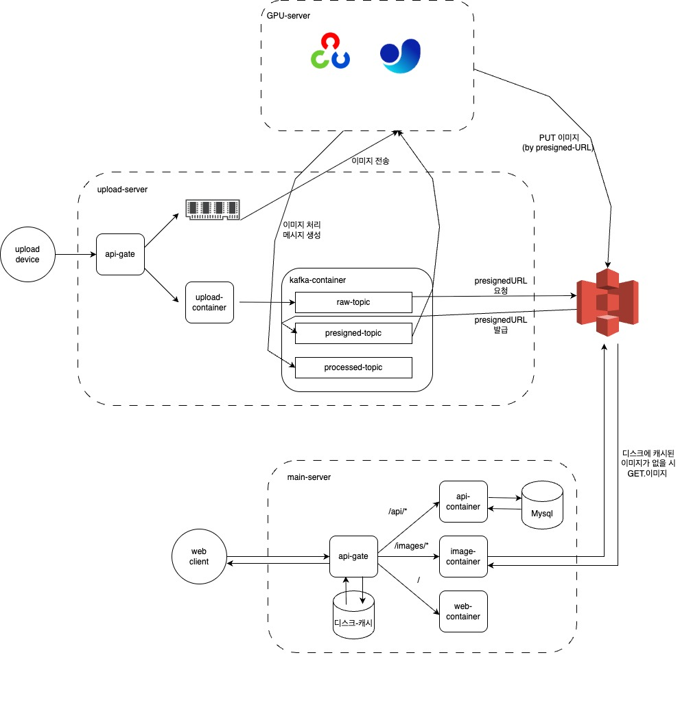

# 예마로 ( Yes My Road )

# 1. 서비스 개요

### Yes, My Road - AI 기반 도로 안전 솔루션
***Yes, My Road***는 시민들의 스마트폰과 최첨단 AI 기술을 결합하여 도로 위의 위험 요소(포트홀, 균열)를 실시간으로 탐지하고,\
지자체의 효율적인 도로 유지보수를 지원하는 혁신적인 AI 기반 도로 안전 솔루션입니다.

### 주요 기능 및 작동 방식:

### 실시간 도로 스캔 및 1차 탐지 (스마트폰 앱):
사용자가 차량 내에 거치된 스마트폰에서 "Yes, My Road" 앱을 실행하면, 주행 중 도로 영상을 자동으로 촬영합니다.
앱에 탑재된 경량화된 온디바이스 YOLO AI 모델이 실시간으로 영상을 분석하여 포트홀 및 균열을 1차적으로 탐지(Segmentation)합니다.

### 정밀 분석 및 데이터 검증 (AI 서버):
1차 탐지된 이미지, 발생 시간, GPS 좌표 데이터는 즉시 GPU 서버로 안전하게 전송됩니다.
GPU 서버에서는 더 강력하고 정교한 고성능 YOLO AI 모델이 해당 데이터를 심층 분석하여 오탐을 최소화하고 탐지 정확도를 극대화합니다.

### 데이터 시각화 및 관리 (웹 플랫폼):
지도 기반 현황판: 최종 검증된 포트홀 및 균열 정보는 웹사이트 지도 위에 핀으로 표시됩니다.
각 핀은 해당 위치의 LRPCI(Long-Term Pavement Condition Index) 기반 손상도 점수를 함께 제공하여 도로 상태의 심각도를 직관적으로 파악할 수 있게 합니다.
핀 클릭 시, 실제 탐지 이미지, 시간, 정확한 좌표 등의 상세 정보를 확인할 수 있습니다.
### 데이터 시각화 대시보드:
### 통계 분석: 
특정 지역에서 어떤 유형의 도로 손상(포트홀, 균열 등)이 주로 발생하는지, 손상도 분포 등을 통계적으로 분석하여 제공합니다.
### 처리 현황: 
지자체의 보수 작업 진행 상황(접수, 처리 중, 완료)을 실시간으로 추적하고 시각화합니다.
### 감지 현황: 
일별, 주별, 월별 또는 지역별 도로 손상 감지 건수 및 추세를 그래프 등으로 보여줍니다.
### 지자체 연동 및 유지보수 지원:
지자체 담당자는 웹사이트를 통해 관할 지역의 도로 상태를 한눈에 파악하고, 우선적으로 보수가 필요한 지점을 선정할 수 있습니다.
보수 작업 완료 후, 해당 핀에 "완료" 처리 버튼을 누르면 지도에서 핀이 사라지거나 상태가 변경되어 체계적인 이력 관리가 가능합니다.

### [ Detect ]

### [ Record ]

### [ Manage ]

  
  

# 2. 시스템 아키텍처

  
  
 
# 3. 파트별 상세 설명 
### [ Front-End ] : [FE 바로가기](./FE/README.md)

### [ APP ] : [APP 바로가기](./APP/README.md)

### [ Back-End ] : [BE 바로가기](./api/README.md)

### [ Infra ] : [KAFKA 바로가기](./reactive/README.md) ,  [IMAGE 바로가기](./image_api/README.md)

### [ DATA ] : [DATA 바로가기](./DT/README.md)

### [ AI ] : [AI 바로가기](./ai/README.md)

  

# 4. 포팅 메뉴얼

### [포팅 메뉴얼] : [포팅 메뉴얼 바로가기](https://foggy-beast-983.notion.site/1fa3a1dda810803ba3b4f4e016959082?pvs=4)

  

#
#
  

# 팀 소개

| 이름 | 역할  | 담당 내용 | 사용 기술 | 
|----------|----------|-----------|-----------|
| 김동휘   | 팀장, 데이터 | 데이터 총괄 | YOLO |
| 전제후   | 데이터 & 시각화 | 데이터 분석 및 시각화 | OpenCV |
| 조현준   | PM, 프론트엔드 | 지도 화면 설계, 데이터 시각화 | NEXT.js , ChartComponent |
| 권동환   | 프론트엔드 | 로그인 보안 설계, API 연동 | NEXT.js |
| 김형표   | 백앤드, 데이터베이스 | API 서버, DB 개발 | SpringBoot, Spring Security, mySQL, Redis, JPQL |
| 이세종   | 백엔드, 인프라 | 업로드 서버, 이미지 서버, 인프라 | Spring(MVC, Webflux), kafka, Nginx, Docker, GitLab-CI, S3 |
